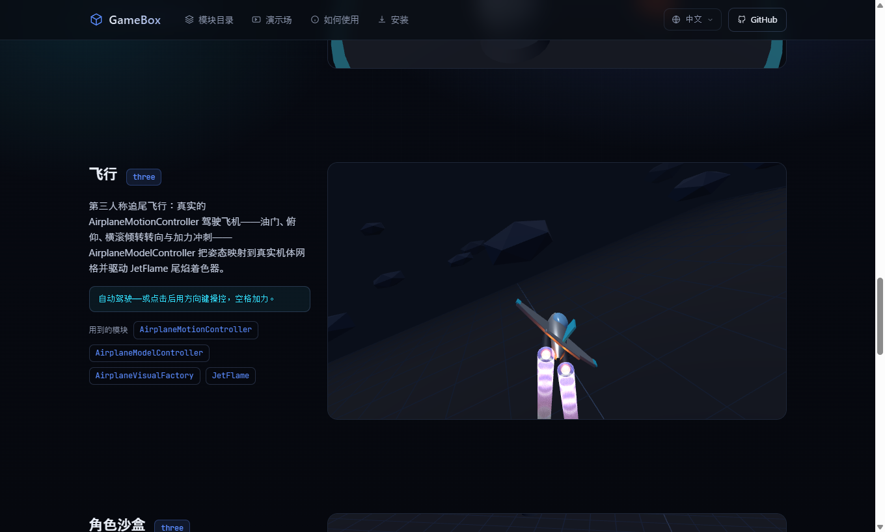
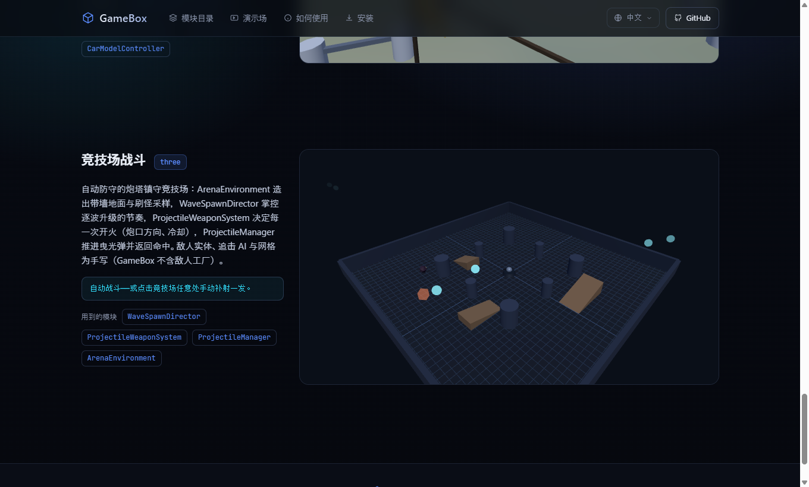

<div align="center">

# 🎮 GameBox



> *「74 块积木，让编码代理搭出空间精确的 3D 游戏。」*


[](https://gamebox.bluecatbot.com/zh/demos/)

<br>

**给编码代理（Claude Code / Codex）的 74 个浏览器 3D 游戏「积木」模块——坐标系、角色运动、相机、玩法、物理，全部语义清晰、可检视、可举一反三。代理不用再从零推导脆弱的 3D 行为，直接从积木组合改写。**

<sub>纯 ESM 模块，three.js / Rapier 全部 vendored 本地，零外部请求。装成本地 skill，代理遇到「浏览器 3D 游戏开发」任务自动发现。</sub>

<br>

[🌐 官网 / 模块目录](https://gamebox.bluecatbot.com) · [🎮 实时演示](https://gamebox.bluecatbot.com/zh/demos/) · [镜像](https://shushuitie2017.github.io/GameBox/)

[看效果](#看效果) · [装进你的代理](#装进你的代理) · [74 个模块](#74-个模块) · [为什么是积木](#为什么是积木)

</div>

---

## 看效果

74 个模块不是纸上代码——**9 个实时 demo 全部由真实模块直接驱动**，覆盖 `pure` / `three` / `rapier` 三个依赖档，点开就能玩：

<p align="center">
  
  
</p>

- **pure（零依赖）** — 贪吃蛇 · 网格寻路 A*
- **three** — 相机机位 · 视觉工厂展厅 · 飞行 · 角色沙盒 · 竞速
- **rapier（物理）** — 物理群集 · 竞技场战斗

每个 demo 下面都列着**它用到的真实模块名**——看得见哪块积木在驱动画面里的行为。

**▶ 全部 9 个实时演示：[gamebox.bluecatbot.com/zh/demos/](https://gamebox.bluecatbot.com/zh/demos/)**

---

## 装进你的代理

GameBox 作为**本地 skill** 使用——当任务涉及浏览器端 3D 游戏开发时，编码代理会自动发现并调用它。

**Claude Code**
```bash
git clone https://github.com/shushuitie2017/GameBox
cd GameBox
mkdir -p ~/.claude/skills/gamebox && cp -R gamebox/. ~/.claude/skills/gamebox/
```
输入 `/gamebox` 调用，或让它在任务匹配时自动加载。

**Codex**
```bash
mkdir -p ~/.codex/skills/gamebox && cp -R gamebox/. ~/.codex/skills/gamebox/
```
输入 `/gamebox` 或 `$gamebox` 调用。

> 也可以直接逛 [官网模块目录](https://gamebox.bluecatbot.com)：搜索、按依赖档筛选、一键复制模块路径。

---

## 74 个模块

七大类，语义清晰、可检视、可组合：

| 类目 | 干什么 |
|---|---|
| 🕹️ **角色 / 载具运动** | 角色控制器、飞机、赛车、蛇——运动学与物理两套 |
| 🧠 **AI 行为** | 寻路、避让、路点跟随、波次生成 |
| 🎥 **相机** | 跟随、姿态、第一人称、偏移机位 |
| 🎯 **玩法状态机** | 贪吃蛇、飞行、竞速圈数、战斗、投射物 |
| 📐 **数学基础** | 世界坐标系、向量、随机、时间——3D 行为的地基 |
| 🖥️ **HUD / UI** | 血条、小地图、准星、控制面板 |
| 🌍 **世界 / 环境 / 视觉** | 地形、竞技场、赛道、视觉工厂（树/车/飞机/岩石/拾取物/投射物） |

**三个依赖档**，按需取用：`pure`（34 个，零依赖纯逻辑）· `three`（31 个，需 three.js）· `rapier`（9 个，需 Rapier 物理）。完整 74 模块 + 依赖关系见 [官网目录](https://gamebox.bluecatbot.com)。

---

## 为什么是积木

**自然语言是精确 3D 行为的薄弱接口。** 提示词得把空间变换压成语言 token，一点歧义就可能方向反转、运动不稳、或让游戏状态和屏幕画面对不上。

GameBox 把脆弱的 3D 与玩法模式，变成**语义清晰、可检视的实现**——代理不用从零推导，而是从积木举一反三，搭出空间精确的 3D 游戏。

**面向有状态的生成式世界。** GameBox 关注世界的**有状态层**，而非视觉美术：当世界渲染模型日益接手视觉生成，GameBox 提供结构化的交互状态，供它们据此渲染、更新、保持一致。

---

## 关于作者 & 也在做

**蓝猫 · BlueCat** —— AI-native builder，把想法快速做成能上线玩的东西。

| | |
|---|---|
| 🐙 GitHub | [@shushuitie2017](https://github.com/shushuitie2017) |
| 🌐 作品总览 | [bluecatbot.com](https://bluecatbot.com) |
| 💬 微信 | 有问题、反馈、想聊两句，扫码加我 ↓ |


**也在做**：[种子树](https://zhongzishu.bluecatbot.com) —— 浏览器里选个物种、拖几下滑块，就长出一株随风摆动的 3D 树，一键导出 glTF。

---

## 许可证

**MIT —— 随便用，随便改，随便造。**

---

<div align="center">

**74 块积木，让编码代理搭出空间精确的 3D 游戏。**<br><br>

▶ [**gamebox.bluecatbot.com**](https://gamebox.bluecatbot.com)

</div>

---

## English

> *"74 building blocks that let coding agents assemble spatially accurate 3D games."*

**GameBox** is a set of **74 browser-3D-game building blocks** for coding agents (Claude Code / Codex) — coordinate frames, actor motion, cameras, gameplay, physics — all as concise, inspectable, composable ESM modules. Instead of deriving fragile 3D behavior from scratch, agents generalize from the blocks.

**▶ Live demos: [gamebox.bluecatbot.com/en/demos/](https://gamebox.bluecatbot.com/en/demos/)** — 9 demos, each driven by real modules, across three dependency tiers (`pure` / `three` / `rapier`).

Install as a local skill so your agent auto-discovers it on browser-3D tasks:
```bash
git clone https://github.com/shushuitie2017/GameBox
mkdir -p ~/.claude/skills/gamebox && cp -R GameBox/gamebox/. ~/.claude/skills/gamebox/
```

**Why blocks?** Natural language is a weak interface for precise 3D — small ambiguities invert directions or desync gameplay from what's on screen. GameBox turns fragile 3D patterns into inspectable implementations with clear semantics, focusing on a world's stateful layer rather than visual aesthetics. Pure ESM, three.js / Rapier vendored, zero external requests.
